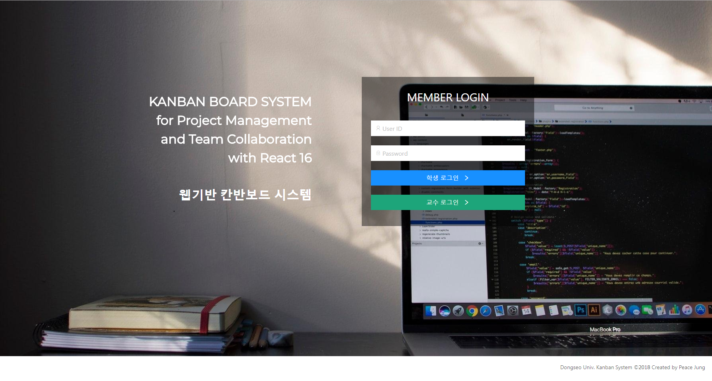

# React Kanban Board

## Documents
Kanban Board used by University for project management

A database schema is essential to use this project.

!!!Warning!!! This repository does not have the schema.
---
### Install
 - Node.js
 - MySQL
---
### Intall
- npm install
---
### Build
- npm run build - Front-end Build
- npm run serverBuild - Node.js server build
---
### Start
- npm run server - localhost:4000
---
### Development Mode
You should use two terminals.
- npm run dev - Watch Front-end
- npm run server - Watch Back-end
---
### Sample Images
#### 1. Main_Login_Page
