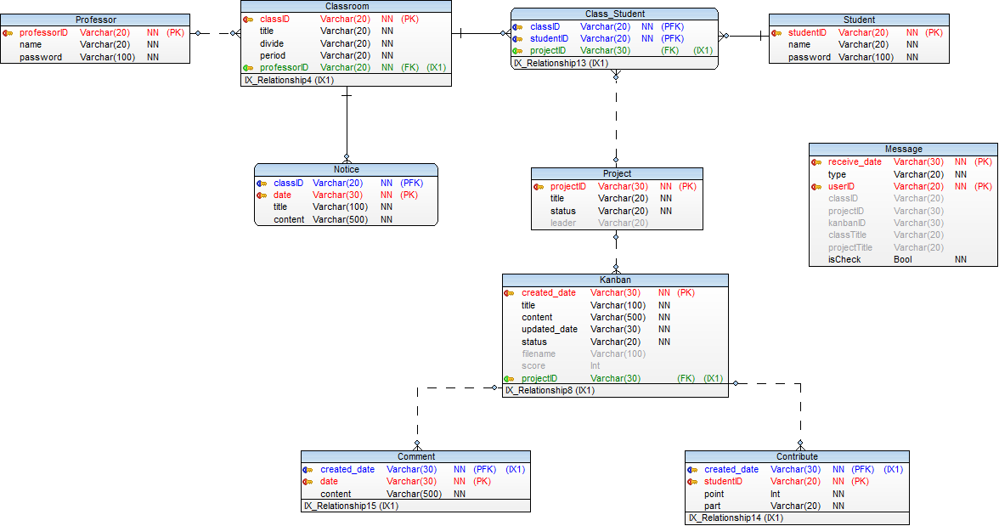

# 프로젝트 관리 및 협업을 위한 웹기반 칸반보드 시스템
# React Kanban Board

## Documents
This is a College Graduation Project.

Web-based Kanban Board System used by University for Project Management and Team Collaboration with ReactJS.

A database is essential to use this project.

## Development Environment
 - Node.js
 - MySQL
 - Windows
 - Ubuntu
 - AWS Cloud9
 - AWS EC2

 ## Skill
 - ReactJS (JavaScript Front-end Library)
 - Node.js (API Server)

 ## Usage
 - Login (Student Or Professor)
 - Select Class
 - Enter Kanbanboard
 - You can change a Kanban Status to Drag & Drop

## Setting Database
1. ./sample/Generated.sql
2. ./sample/userSample.sql
3. ./sample/classroomSample.sql

## Not Used Database
현재는 초기에 데이터베이스 환경설정 없이 테스트 할 수 있도록 개발되어 있습니다.
<code>/server/models</code> 를 불러오면 데이터베이스를 세팅해야하고
<code>/server/sampleModels</code> 를 불러오면 임시 데이터 리스트를 이용하여 사용할 수 있습니다.

## Intall
<code>yarn</code> - yarn install

## Build
<code>yarn build</code> - Client Build

## Start
<code>yarn start</code> - localhost:4000

## Sample Images
#### 0. Sample_Scenario

#### 1. Main_Login_Page

#### 2. Main_Classroom_Page

#### 3. Kanbanboard_Page

#### 4. Kanban_Info_Page

#### 5. Project_List_Page

#### 6. Message_Page

#### 7. Database_Structure

